# Full Stack Development Series

## Front-End Week 1

### Back to the Front-End

### Reminders

- Most talks will be using React, but all templates are available in the repo for you to follow along with in Vue or Angular

- Feel free to to speak up at any time. This is not just me talking. And I will call on people.

- Some topics I will talk about in this series may have been covered in the React talks. If so I will go over them in more depth and detail this time.

- All the feedback. The lesson plan for this whole series is directly related to what **YOU** want to learn.

### Structure

- Front-end will follow the back-end lessons and use them for continuity

- First lessons will be code light and config heavy (more in a bit)

- Every week we will cover a new pattern, library, testing concept, config, and CI/CD options.

- Goal is to keep a working app at all times that you can others can reference when needed

- If I emphasize something, its really important. There will be a good amount of emphasis in the first weeks.

### The Most Important Idea to Remember

> Code = Tooling, Testing, and DevOps

The code your produce is a direct result of those three inputs. Focus on those, and your application will thrive.

### To The Demo

#### .vscode Folder

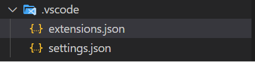

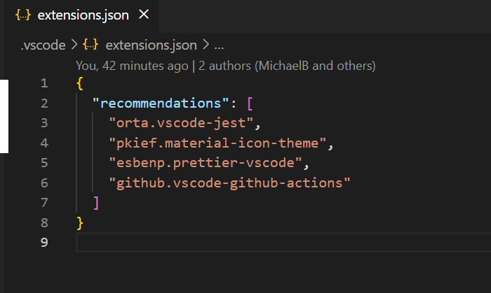

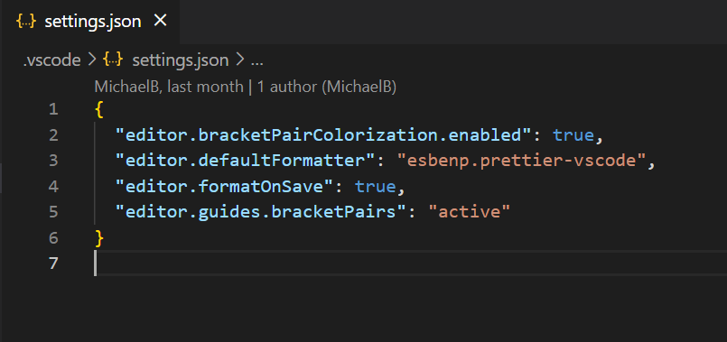

#### Github Folder

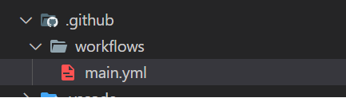

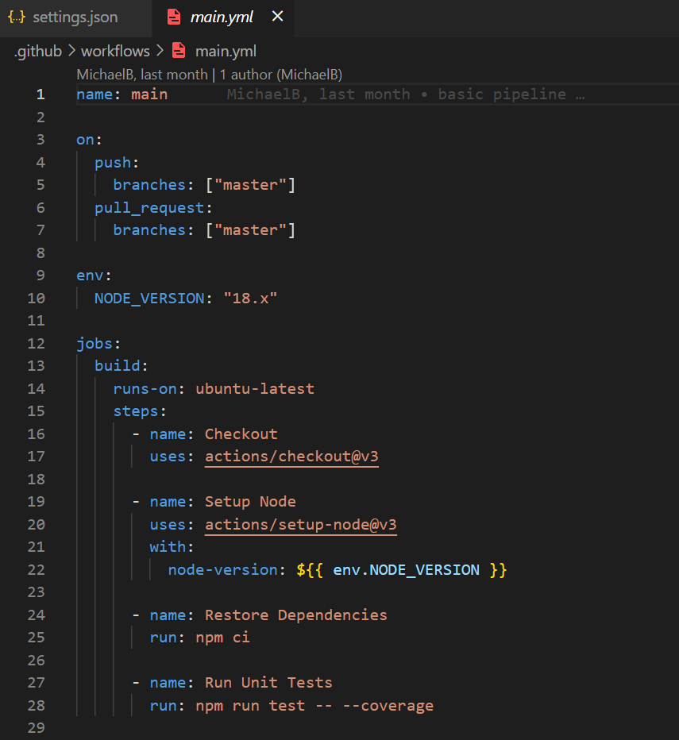

#### Le Formatting

Linting !=== Formatting

[Straight From The Horses Mouth](https://typescript-eslint.io/linting/configs#formatting)

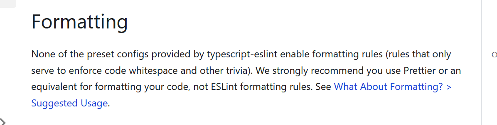

[Use the Prettier, Love the Prettier](https://prettier.io/)

- Being on a project without a formatter, or properly configured formatter, or the wrong formatter is pure hell.

##### Three NPM packages

[Prettier Itself](https://www.npmjs.com/package/prettier) - Base formatter

[The ESLint Config](https://www.npmjs.com/package/eslint-config-prettier) - Disables all rules that conflict with Prettier

[The ESLint Plugin](https://www.npmjs.com/package/eslint-plugin-prettier) - Runs Prettier as a linter plugin

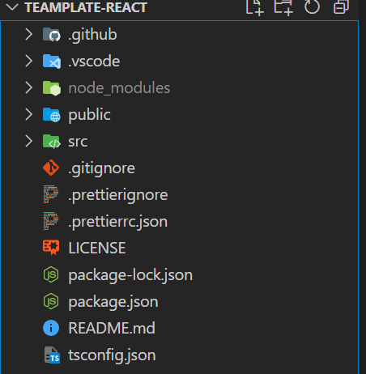

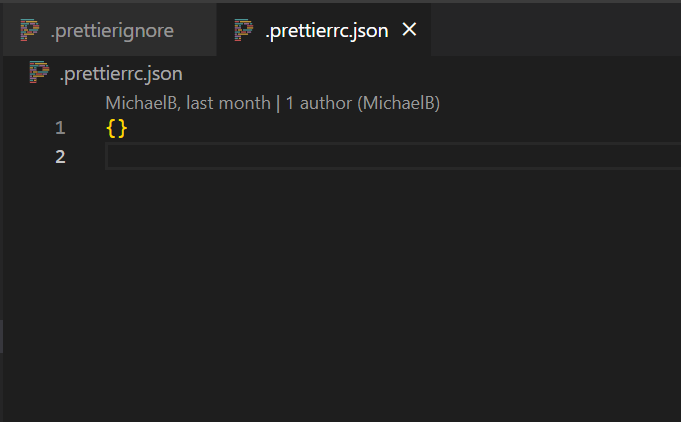

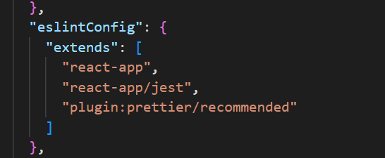

> Order Matters: last plugin === most important

#### Testing

Want to be a better front-end developer overnight?

Start testing your code. And enforce it.

- Forced testing means you can get away with a lot less than before.

- Can't check in 500+ line components
- Can't have god classes/components that do everything
- Makes your life easier. Makes other developers lives easier
- Force you to use correct accessibility and SEO conventions (i.e. Inputs need a Label, Proper headings)

> Tests are Insurance. We all hate it, but its mandatory.

##### Eco System

99% of the EcoSystem is the exact same between Angular, Vue, and React. The main differences are in the config files.

[Jest](https://jestjs.io/)/[ViTest](https://vitest.dev/) - Test Runner, Mocks, Code Coverage, Matchers
[Testing Library](https://testing-library.com/) - Render Utilities, Queries
[Jest DOM](https://testing-library.com/docs/ecosystem-jest-dom/) - Extra Matchers
[User Event](https://testing-library.com/docs/user-event/intro) - Mimic User Interactions
[Cypress](https://cypress.io) - Integration/E2E Testing

(Jest Extended, Plugins, TypeScript support, Linting & Formatting Rules)

###### Things I Wish I Knew Earlier (I.E. Developers hate this four simple rules for writing tests)

1. You are testing user interactions (no query by css class)
2. If it's hard to test, your component probably needs work
3. "GetByRole" is your baby [Default Roles](https://www.w3.org/TR/html-aria/#docconformance)
4. Read the Docs first (Jest Dom, Testing Library) Get accustomed to the most common matchers!

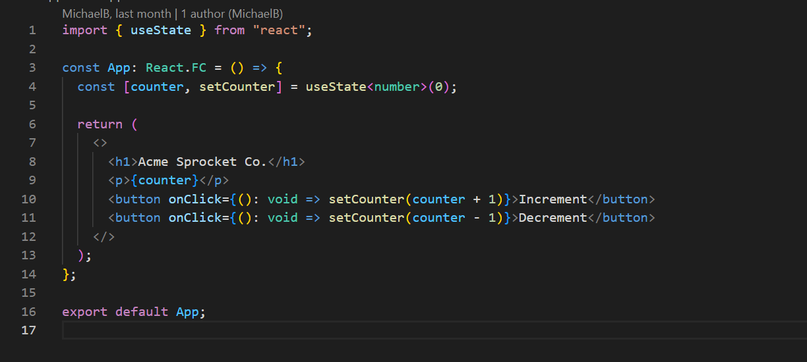

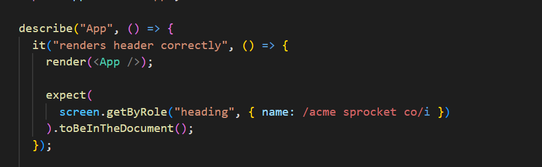

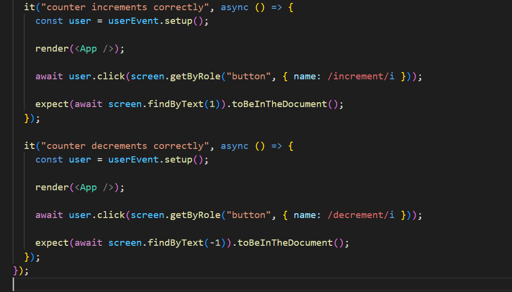

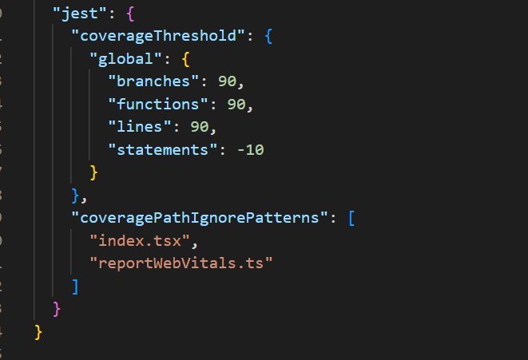

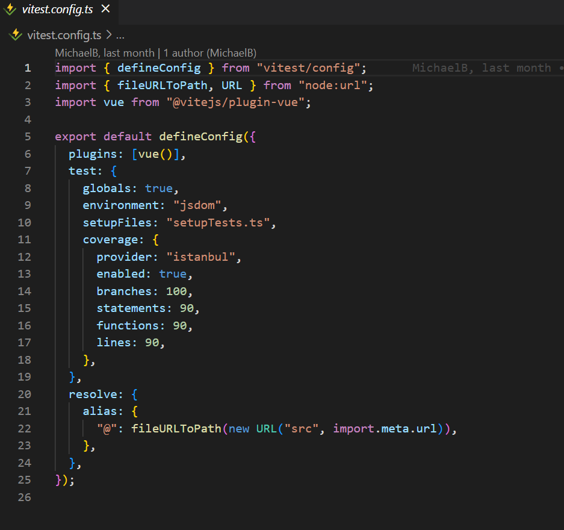
