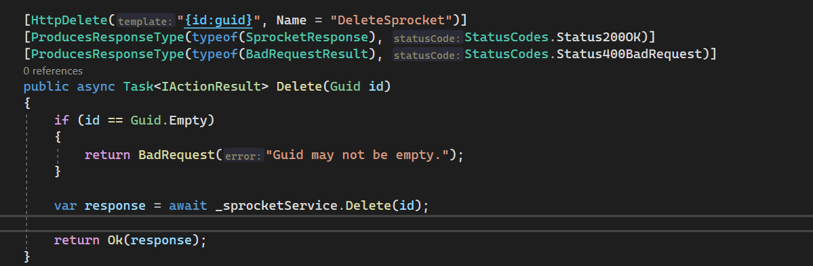
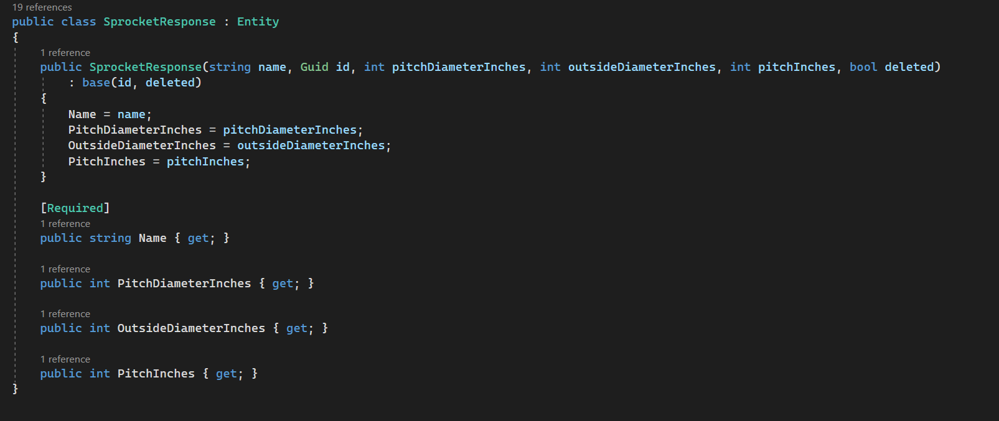

# Full Stack Development Series

## Front-End Week 2

### Just Can't Be Normal

- The Code Samples today will be in Vue


### Today's Subject Matter

- Updates to our config

- ESLint type-checking

- Swagger TypeScript API client

- Our first hook/composable

- Testing Updates

#### Config Updates

##### CI/CD

Our pipeline now has a step for running the linter and building the project.

Note: In Vue, the build step actually has its own separate type checking.

```yaml
name: main

on:
  push:
    branches: ["master"]
  pull_request:
    branches: ["master"]

env:
  NODE_VERSION: "18.x"

jobs:
  build:
    runs-on: ubuntu-latest
    steps:
      - name: Checkout
        uses: actions/checkout@v3

      - name: Setup Node
        uses: actions/setup-node@v3
        with:
          node-version: ${{ env.NODE_VERSION }}

      - name: Restore Dependencies
        run: npm ci

      - name: Lint Application
        run: npm run lint

      - name: Run Unit Tests
        run: npm run test:unit

      - name: Build Application
        run: npm run build
```

##### Extensions

```json
{
  "recommendations": [
    "Vue.volar",
    "Vue.vscode-typescript-vue-plugin",
    "pkief.material-icon-theme",
    "zixuanchen.vitest-explorer",
    "esbenp.prettier-vscode",
    "github.vscode-github-actions",
    "dbaeumer.vscode-eslint",
    "aaron-bond.better-comments",
    "eamodio.gitlens"
  ]
}
```

##### GitAttributes

A little config helper for git to tell it the format of the files. Makes git play nice with out file endings.

[GitAttributes generator!](https://gitattributes.io/)

```text
*           text=auto

*.vue       text eol=lf
*.ts        text eol=lf
*.markdown  text diff=markdown
*.md        text diff=markdown
*.scss      text diff=css
*.json      text
*.css       text diff=css
*.htm       text diff=html
*.html      text diff=html

*.*rc       text
```

#### ESLint Updates

Anyone know who this is?


Janus is a good metaphor for TypeScript because there is "TypeScript" which is the lip-stick on a pig version and big boy TypeScript.

[Big Boy Type Checking](https://typescript-eslint.io/linting/configs#recommended-requiring-type-checking)

- TypeScript without real type-checking is just JavaScript.

##### ESLint Config for Vue

```json
{
  "root": true,
  "parser": "vue-eslint-parser",
  "parserOptions": {
    "parser": "@typescript-eslint/parser",
    "sourceType": "module",
    "ecmaVersion": "latest",
    "project": [
      "./tsconfig.json",
      "./tsconfig.vitest.json",
      "./tsconfig.app.json"
    ]
  },
  "extends": [
    "eslint:recommended",
    "plugin:@typescript-eslint/recommended",
    "plugin:@typescript-eslint/recommended-requiring-type-checking",
    "plugin:@typescript-eslint/strict",
    "@vue/eslint-config-typescript",
    "plugin:vue/vue3-recommended",
    "plugin:prettier/recommended"
  ],
  "rules": {
    "@typescript-eslint/explicit-function-return-type": 2
  },
  "overrides": [
    {
      "files": ["cypress/e2e/**/*.{cy,spec}.{js,ts,jsx,tsx}"],
      "extends": ["plugin:cypress/recommended"]
    }
  ]
}
```

... for React or Angular

```json
{
  "parserOptions": {
    "project": "./tsconfig.json"
  },
  "extends": [
    "eslint:recommended",
    "plugin:@typescript-eslint/recommended",
    "plugin:@typescript-eslint/recommended-requiring-type-checking",
    "plugin:@typescript-eslint/strict",
    "insert-react-plugins-here"
    "plugin:prettier/recommended"
  ],
  "rules": {
    "@typescript-eslint/explicit-function-return-type": 2
  },
  "overrides": [
    {
      "files": ["cypress/e2e/**/*.{cy,spec}.{js,ts,jsx,tsx}"],
      "extends": ["plugin:cypress/recommended"]
    }
  ]
}
```

- But it's Vue, so there's more...


##### shims-vue.d.ts

- This was originally in Vue 2 templates for typescript, but removed.

```typescript
declare module "*.vue" {
  import type { DefineComponent } from "vue";
  const component: DefineComponent<{}, {}, any>;
  export default component;
}
```

##### ESLint Ignore

```json
src/shims-vue.d.ts
vitest.config.ts
src/data/Api.ts
```

##### Recap

[Typed Linting Docs](https://typescript-eslint.io/linting/typed-linting)
[Info for Vue](https://typescript-eslint.io/linting/troubleshooting#i-am-running-into-errors-when-parsing-typescript-in-my-vue-files)

- Add the type-checking and strict plugins
- Configure your parser options
- (Vue) add the shims file definition
- Update ESLint Ignore file as needed

#### TypeScript Swagger API

[GitHub Repo](https://github.com/acacode/swagger-typescript-api)

No more boilerplate for:

- Request/Response objects
- API route definitions
- Integrates with Axios
- Forces you to have good API and response definitions





> You will still needs to handle errors/routing/weird situations.

##### Directory


> This is both Git and Prettier ignored

##### Code

```json
"swagger": "npx swagger-typescript-api --axios -p ./swagger/swagger.json -o ./src/data -n Api.ts"
```

Currently we have very few endpoints and this file is almost ~500 lines long.

##### .env

```text
VITE_API_URL = "https://localhost:44308/"
```

##### ApiClient

```typescript
import type { AxiosRequestConfig } from "axios";
import { Api } from "./Api";

export default function apiClient(): Api<void> {
  const config: AxiosRequestConfig = {
    baseURL: import.meta.env.VITE_API_URL as string,
  };

  return new Api(config);
}
```

#### useFetchData

Our first custom hook/composable.

> Custom hooks are nothing more than wrappers over other hooks.

They needs to:

- Contain others hooks
- Only exist inside components
- Naming starts with "useXXX"

##### Vue Being Special again

Custom hooks in Vue need to return either a single ref, deconstructed array or object of refs.

```typescript

// ok!
const a = useMyHook();

// ok!
const [a, b] = useMyHook();

// ok!
const { a, b } = useMyHook();

// object wrapped in reactive function.
const myHookObject = reactive(useMyHook());
```

##### Our Hooks

> We will add to this in the future. (rerouting, loading status, ect)

```typescript
import type { AxiosResponse } from "axios";
import { onMounted, ref, type Ref } from "vue";

export default function useDataFetch<T>(
  defaultResponse: T,
  callback: () => Promise<AxiosResponse<T>>
): [Ref<T>, Ref<string>] {
  const data = ref<T>(defaultResponse) as Ref<T>;
  const errorMessage = ref<string>("");

  onMounted(() => {
    callback()
      .then((response) => (data.value = response.data))
      .catch((error: string) => {
        // TODO: Will update later.
        errorMessage.value = error;
      });
  });

  return [data, errorMessage];
}
```

> React has a testing utility: [React Hooks Testing Library](https://react-hooks-testing-library.com/)

For Vue we need to write a custom component wrapper:

```typescript
<template>
  <p>{{ result }}</p>
  <p>{{ reject }}</p>
</template>

<script setup lang="ts">
import { AxiosHeaders, type AxiosResponse } from "axios";
import useDataFetch from "./UseDataFetch";

export interface UseDataFetchWrapperProperties {
  shouldReject: boolean;
}

const properties = defineProps<UseDataFetchWrapperProperties>();

const promise = new Promise<AxiosResponse<string>>((resolve, reject) => {
  if (properties.shouldReject) {
    reject("call failed");
  } else {
    resolve({
      data: "stringResponse",
      status: 200,
      statusText: "success",
      headers: {},
      config: {
        headers: new AxiosHeaders(),
      },
    });
  }
});

const [result, reject] = useDataFetch("", () => promise);
</script>
```

Our Test...

```typescript
import { render, screen } from "@testing-library/vue";
import UseDataFetchWrapper from "./UseDataFetchWrapper.vue";

describe("useDataFetch", () => {
  it("returns response", async () => {
    render(UseDataFetchWrapper, { props: { shouldReject: false } });

    expect(await screen.findByText(/stringResponse/i)).toBeInTheDocument();
  });

  it("rejects properly", async () => {
    render(UseDataFetchWrapper, { props: { shouldReject: true } });

    expect(await screen.findByText(/call failed/)).toBeInTheDocument();
  });
});
```

#### Containers

Pros:

Separate logic from presentation
Repository pattern for front end (Container is implementation, Props are interface, Component is the consumer)
Must easier component testing since most are pure now

Cons:
You need another component

##### FindAllSprocketsContainer

```typescript
<template>
  <FindAllSprockets :response="response" />
</template>

<script setup lang="ts">
import useDataFetch from "@/common/hooks/use-data-fetch/UseDataFetch";
import FindAllSprockets from "./FindAllSprockets.vue";
import apiClient from "@/data/ApiClient";
import defaultFindAllSprocketsResponse from "./DefaultFindAllSprocketsResponse";
import { ref } from "vue";

const page = ref<number>(0);
const pageSize = ref<number>(10);

const [response] = useDataFetch(
  defaultFindAllSprocketsResponse,
  async () =>
    await apiClient().api.findAllSprockets({
      page: page.value,
      pageSize: pageSize.value,
    })
);
</script>
```

##### Dead Simple Pure Component

```typescript
<template>
  <table>
    <thead>
      <tr>
        <th>Name</th>
        <th>Pitch Diameter</th>
        <th>Pitch Outside Diameter</th>
        <th>Pitch Inches</th>
      </tr>
    </thead>
    <tbody>
      <tr v-for="item in response.responses" :key="item.id">
        <td>{{ item.name }}</td>
        <td>{{ item.pitchDiameterInches }}</td>
        <td>{{ item.outsideDiameterInches }}</td>
        <td>{{ item.pitchInches }}</td>
      </tr>
    </tbody>
  </table>
</template>

<script setup lang="ts">
import type { SprocketResponsePageResponse } from "@/data/Api";

export interface FindAllSprocketsProperties {
  response: SprocketResponsePageResponse;
}

defineProps<FindAllSprocketsProperties>();
</script>

```

##### Easy Test

```typescript
import { render, screen } from "@testing-library/vue";
import FindAllSprockets, {
  type FindAllSprocketsProperties,
} from "./FindAllSprockets.vue";
import propsWrapper from "@/common/tests/PropsWrapper";

describe("findAllSprockets", () => {
  it("renders properly", () => {
    const properties: FindAllSprocketsProperties = {
      response: {
        responses: [
          {
            name: "AE72",
            id: "1",
            pitchDiameterInches: 5,
            pitchInches: 10,
            outsideDiameterInches: 10,
            deleted: false,
          },
        ],
        totalCount: 1,
      },
    };

    render(FindAllSprockets, propsWrapper(properties));

    expect(screen.getByText(/AE72/i)).toBeInTheDocument();
  });
});
```

##### Vue Gonna Vue


```typescript
import type { RenderOptions } from "@testing-library/vue";

export default function propsWrapper<T extends object>(data: T): RenderOptions {
  return { props: data };
}

```