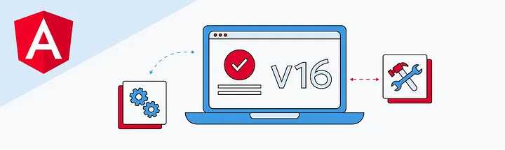
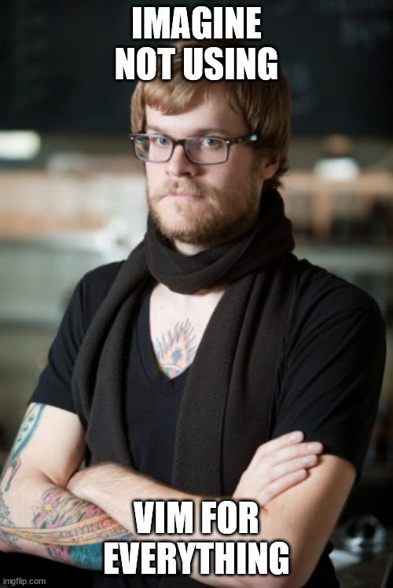

# Full Stack Development Series

## Front-End Week 3

### Angular 16



Angular 16 is out with a lot of new updates!

### Quick Config Updates

#### CSpell

[CSpell](https://marketplace.visualstudio.com/items?itemName=streetsidesoftware.code-spell-checker) is a simple spell-checker add-on that you can configure.

A cspell.json file goes in your .vscode folder.

##### cspell.json

```json
{
  "words": ["acacode", "aspirent"]
}
```

#### Editorconfig

The main reason for using an editorconfig.



Comes default in Angular project, but not in React or Vue projects.

EditorConfigs are supported by default in "most" IDE's including Vim, Emacs, and VisualStudio.

There is [a plug-in](https://marketplace.visualstudio.com/items?itemName=EditorConfig.EditorConfig) for VSCode.e

##### Example .editorconfig

```json
root = true

[*]
end_of_line = lf
max_line_length = 80
charset = utf-8
indent_style = space
indent_size = 2
insert_final_newline = true
trim_trailing_whitespace = true
```

> Note: EditorConfig has the "final say". Make sure your Prettier settings line up with the EditorConfig.

#### Husky

Easy way to integrate git-hooks in your projects.

Documentation [here.](https://typicode.github.io/husky/)

Currently used for:

- Running prettier on commit (combine with [pretty-quick](https://github.com/azz/pretty-quick))
- Running the linter on push
- NPM Install on post-merge

### Angular 16

#### Signals

Signals are Angular's version of hooks from React or composables from Vue.

They work almost the exact same way.

##### State

```typescript
// React
const [state, setState] = useState<string>('mike');

// Vue
const state = ref<string>('mike');

// We're in a class, not a function. Angular
public state = signal<string>('mike');
```

##### Computed

```typescript
//React
const fullName = (): string => `${first} ${last}`;

// Vue
const fullName = computed<string>(() => `${first} ${last}`);

// Angular
public fullName = computed<string>(() => `${first} ${last}`);
```

##### Effects

```typescript
// React
useEffect(() => {
    console.log('name updated');
}, [fullName]);

// Vue
watch(fullName, () => {
    console.log('name updated');
});

// Angular. Note, the effect function doesn't require a dependency.
private updated = effect(() => console.log("effect fired", this.full())); 
```

##### Custom Hooks

```typescript
import { WritableSignal, signal } from "@angular/core";

export default function useToggle(): {
  toggle: WritableSignal<boolean>;
  handleUpdate: () => void;
} {
  const toggle = signal<boolean>(false);

  const handleUpdate = (): void => {
    toggle.set(!toggle());
  };

  return { toggle, handleUpdate };
}
```

> Because of the nature of Angular using classes for components over functions. I don't recommend return arrays since you can't destructure them in a class like you can in a function.

```typescript
<div>
  <input
    type="checkbox"
    [checked]="hook.toggle()"
    (change)="hook.handleUpdate()"
  />
  <p>Toggle enabled: {{ hook.toggle() }}</p>
</div>
```

> You need to call the signal as a function in the template. (I.E. KnockoutJS). They are NOT automatically de-reffed in code.

#### Future Updates


> Nothing here is released and is subject to change.

##### Signals as Inputs

Signal-based components

```typescript
@Component({
  signals: true,
  selector: 'user-profile',
  template: `
    <p>Name: {{ firstName() }} {{ lastName() }}</p>
    <p>Account suspended: {{ suspended() }}</p>
  `,
})
export class UserProfile {
  // Create an optional input without an initial value.
  firstName = input<string>(); // Signal<string|undefined>

  // Create an input with a default value
  lastName = input('Smith'); // Signal<string>

  // Create an input with options.
  suspended = input<boolean>(false, {
    alias: 'disabled',
  }); // Signal<boolean>
}
```

##### Two-Way Binding via Models

```typescript
@Component({
  signals: true,
  selector: 'some-checkbox',
  template: `
    <p>Checked: {{ checked() }}</p>
    <button (click)="toggle()">Toggle</button>
  `,
})
export class SomeCheckbox {
  // Create a model, which is a *writable* signal that supports two-way binding.
  checked = model(false);

  toggle() {
    // Normal inputs are read-only, but a model is writable
    // and propagates the value back to the parent.
    checked.update(c => !c);
  }
}

@Component({
  signals: true,
  selector: 'some-page',
  template: `
    <!-- Note that the getter is *not* called here, the raw signal is passed -->
    <some-checkbox [(checked)]="isAdmin" />
  `,
})
export class SomePage {
  isAdmin = signal(false);
}
```

#### Jest Support

Jest is now supported in experimental mode in Angular 16. You need to update your angular.json

```json
{
  "projects": {
    "my-app": {
      "architect": {
        "test": {
          "builder": "@angular-devkit/build-angular:jest",
          "options": {
            "tsConfig": "tsconfig.spec.json",
            "polyfills": ["zone.js", "zone.js/testing"]
          }
        }
      }
    }
  }
}
```

You still need to install some package separately such as Jest, JestDOM, @types/Jest for this to work. They aren't not installed for you.

> Testing Library does not work with Angular 16 yet.

#### Self-Closing Component Tags

```html
<!-- pre 16 -->
<signal-practice></signal-practice>

<!-- Angular 16 -->
<signal-practice />
```

#### TypeScript 5.0 Support in 16
