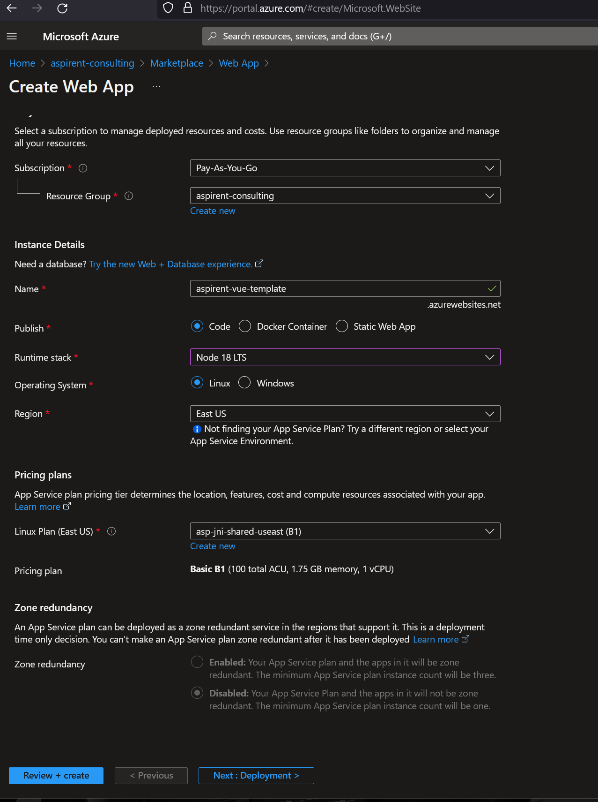
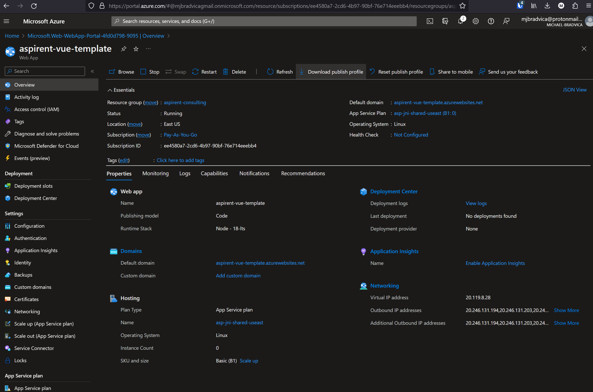
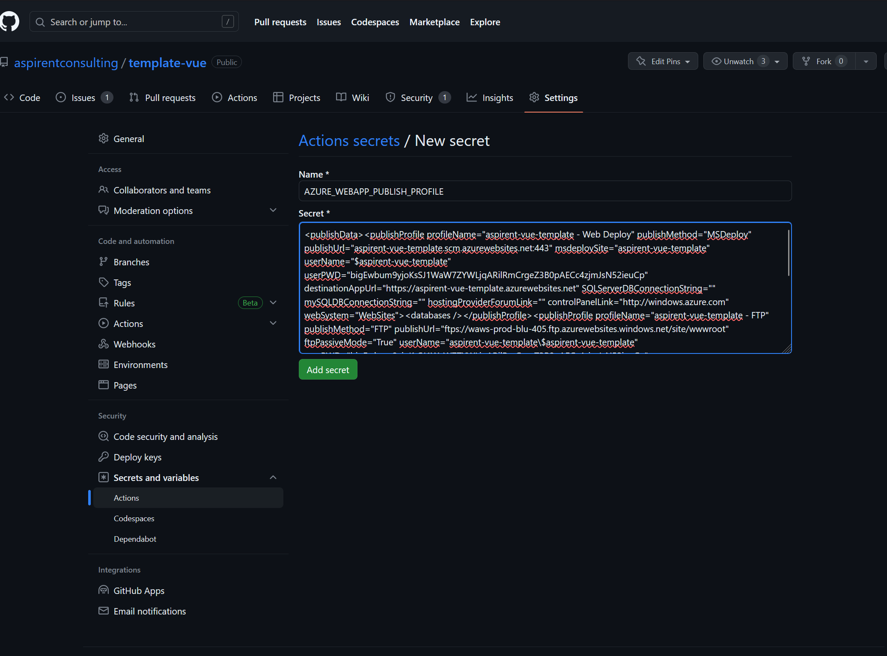
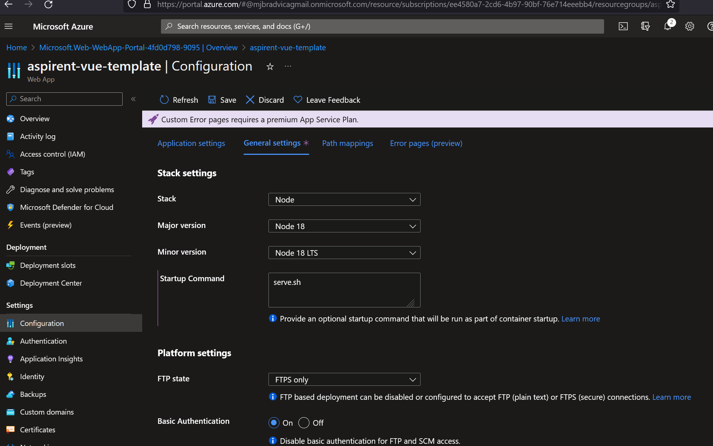

# Full Stack Development Series

## Front-End Week 4

### Routing (Condensed)

- Note: I can't go into great details regarding routing. But I can give you some pitfalls to avoid-and some suggestions.

React - [React Router](https://reactrouter.com/en/main)
Vue - [Vue Router](https://router.vuejs.org/)
Angular - [Built-In Router](https://angular.io/guide/routing-overview)

- A lot of the concepts for all three routers is the same.

1. Defining routes via objects

```typescript
const myRoute: Route = {
    path: 'sprockets',
    component: SprocketIndex
};
```

2. Each route takes a path and component

> React allows you to define routes via "component syntax". But I recommend you stick with the normal boring way as it is consistent between all three frameworks.

```typescript
<Routes>
  <Route path="/" element={<App />}>
    <Route index element={<Home />} />
    <Route path="teams" element={<Teams />}>
      <Route path=":teamId" element={<Team />} />
      <Route path=":teamId/edit" element={<EditTeam />} />
      <Route path="new" element={<NewTeamForm />} />
      <Route index element={<LeagueStandings />} />
    </Route>
  </Route>
  <Route element={<PageLayout />}>
    <Route path="/privacy" element={<Privacy />} />
    <Route path="/tos" element={<Tos />} />
  </Route>
  <Route path="contact-us" element={<Contact />} />
</Routes>
```

3. Navigate via a build-in component or directive

```typescript
<Link :to="/myPath">Go Somewhere</Link>
```

4. Navigate programmatically via a hook

```typescript
const router = useRouter();

if(error) {
    router.push("/error");
}
```

5. Use an outlet for layouts

- App.ts
```typescript
<header></header>
<main>
    <router-outlet></router-outlet>
<main>
<footer></footer>
```

#### Suggestions

##### Named Vue Routes

If you are using Vue, it is recommended to use named routes. This allows you assign each route a named variable.

From the Vue website:

- No hardcoded URLs
- Auto encode/decode of params
- Reduces typos in the url
- Bypassing path ranking

```typescript
const routes = [
  {
    path: '/user/:username',
    name: 'user',
    component: User
  }
]
```

Allows you to do this...

```typescript
<router-link :to="{ name: 'user' }">
  User
</router-link>
```

I suggest you role it up into a reusable function:

```typescript
export interface INamedRoute extends RouteLocationNamedRaw {
  name: string;
}

export function namedRoute(name: string): INamedRoute {
  return {
    name,
  };
}
```

Then...

```typescript
<router-link :to="namedRoute('myPath')">Go Somewhere</router-link>
```

##### React Index Elements

A gotcha to avoid in React is that "index" routes don't require a path.

```typescript
let routes = [
  {
    element: <App />,
    path: "/",
    children: [
      {
        index: true,
        element: <Home />,
      },
      {
        path: "teams",
        element: <Teams />,
        children: [
          {
            index: true,
            element: <LeagueStandings />,
          },
          {
            path: ":teamId",
            element: <Team />,
          },
          {
            path: ":teamId/edit",
            element: <EditTeam />,
          },
          {
            path: "new",
            element: <NewTeamForm />,
          },
        ],
      },
    ],
  },
];
```

##### Organization

Another reason for using feature folders it that it allows you to break up your routes per feature.

I'm sure everyone has had to deal with a route file that turns into a monster where it is hard to find anything. Avoiding this is rather easy.

```typescript
import type { RouteRecordRaw } from "vue-router";
import FindAllSprocketsContainer from "../find-all/FindAllSprocketsContainer.vue";

export const sprocketIndex = "sprocketIndex";

export const sprocketRoutes: RouteRecordRaw = {
  path: "sprocket",
  name: sprocketIndex,
  component: FindAllSprocketsContainer,
};
```

You can add each feature to the main router as you go.

### Deployment

- This is for GitHub and Azure App Services. There are far too many options to choose from-but these are two of the popular ones.

- Note: I am using the Linux version of App Services. I find it to be much easier to deal with than Windows and you get Docker out of the box.



The linux version comes with [pm2](https://pm2.io/) which is a process manager that allows us to boot the application pain free and not have to worry about messing with IIS configs or redirects.

In your public folder you will need a small script.

serve.sh

```shell
pm2 serve /home/site/wwwroot --no-daemon --spa
```

The spa command is a set of standard defaults, and the no-daemon command is required to allow pm2 to run in the foreground.

- Grab your publish profile:



- Paste it into your repo as a secret:



In Azure -> App Service -> Configuration -> General Settings

Tell if the name of our startup script.



Update our CI/CD:

```yaml
      - name: Build Application
        run: npm run build

      - name: Deploy Application
        uses: azure/webapps-deploy@v2
        with:
          images: ""
          app-name: ${{ env.AZURE_WEBAPP_NAME }}
          publish-profile: ${{ secrets.AZURE_WEBAPP_PUBLISH_PROFILE }}
          package: ./dist
```

- The Azure webapp name is the same as what we entered as "aspirent-vue-template"

- Note: In React the build folder is called "build".

[Result](https://aspirent-vue-template.azurewebsites.net/)