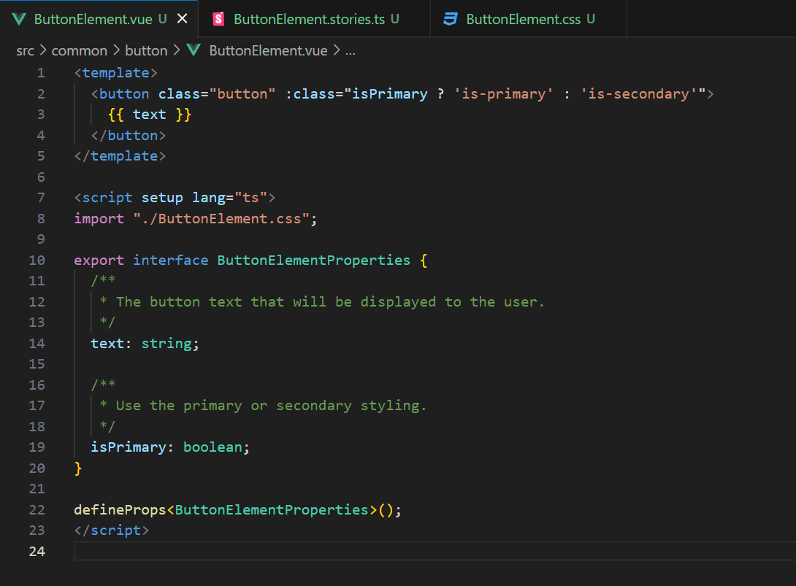
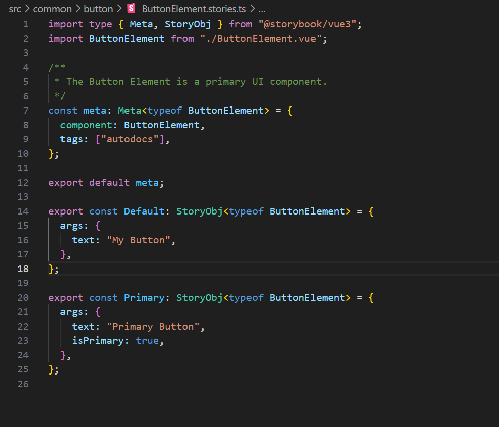
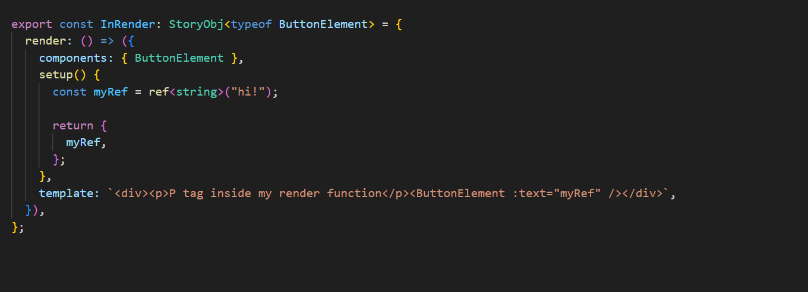
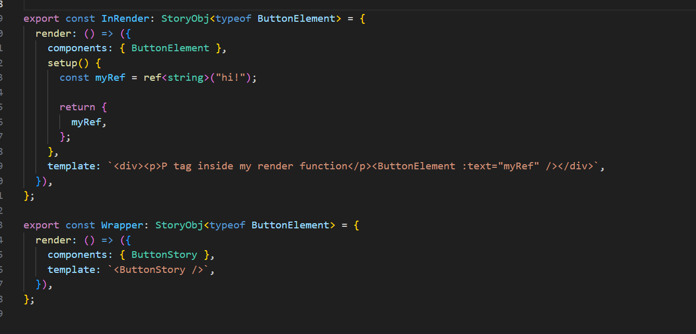

# Full Stack Development Series

## Front-End Week 5

### Storybook.js

[Storybook.js](storybook.js.org) - "Storybook is a frontend workshop for building UI components and pages in isolation."

It's documentation that you can actually use.

- Utilizes the code base to generate the documentation, when you update your codebase, storybook updates too.

- Can live as a real-life web application. You can deploy storybook to an app server in the same way you deploy a react or vue app.


#### Real-life Use Cases

- Living Documentation for the development team (Don't need to right-click -> view source to explore components)
- Easy testing (Mobile views built in, easier than browser tools)
- Sandbox for new development that is isolated (Don't need to shoe-horn it into an existing component or add a fake route to see it)
- Project Manager or Client that is nosey. Question: "What did you guys work on today" Answer: "Latest is deployed on the storybook site"
- Lots of plugins:
    [Interactions](https://storybook.js.org/docs/react/essentials/interactions) (Installed by default) - Show people how components work automatically (uses testing library and user event)
    [A11y](https://storybook.js.org/addons/@storybook/addon-a11y/) - Accessibility
    [StorySource](https://storybook.js.org/addons/@storybook/addon-storysource/) - Source code
    [Jest](https://storybook.js.org/addons/@storybook/addon-jest/) - Test results

#### Existing Frameworks

Even if you use an existing framework such as Foundation, Bootstrap, or Bulma. Storybook is still helpful since there is a likely chance that your components are different and more complex than in the default documentation.

Storybook almost feels mandatory if you are using TailwindCss.

> Personal Opinion: I've noticed that Storybook.js forces me to write better code overall. Just like when you force testing on yourself-forcing storybook will constrain your options.

### Installation

```shell
npx storybook@latest init
```

- Does everything for you. Even asks to install an eslint plugin.

- The installation will give you some samples-however some are out of date or may not be updated for V7. I would not use these as reliable examples.

### Quick Example





#### Render Option

- At some point you will probably need to create an abstraction around a story.

Typically comes into play with hooks.

##### Option One - Use The render function



##### Options Two - Wrapper Component

